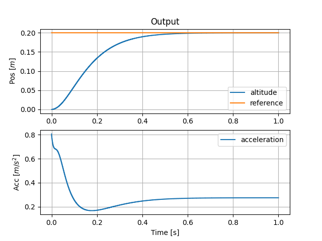

.. _examples-label:

Examples
========

Altitude Control of a Quadcopter
--------------------------------

Imagine you have a quadcopter, and you need the drone to hover at a certain altitude. 

.. note::

    The equations governing the relationship between thrust and altitude is given as the following:

    .. math::

        \ddot{z} = g - (\cos{\phi}\cos{\theta})\cdot\frac{u}{m}

    Where *g* is the gravity, *u* is the thrust provided by the rotors and *m* is the mass of the quadcopter. Considering a perfectly horizontal quadcopter, pitch and roll are zero, and the equation reduces to:

    .. math::

        \ddot{z} = g - \frac{u}{m}

    Implemented as:

    .. code-block:: python
       
       quadcopter = pyadrc.QuadAltitude(dt, m, g)

Let :math:`g` be the gravity of Earth and the mass of the quadcopter :math:`m = 0.028 kg`

We will use a second-order approximation for all our cases and sampling time

+--------+------------+-------------------+-----------------+
|        |:math:`b_0` | settling time [s] | :math:`k_{ESO}` |
+--------+------------+-------------------+-----------------+
| Case 1 |  1/0.028   |       0.5         |       10        |
+--------+------------+-------------------+-----------------+
| Case 2 | 1/0.028/4  |       0.5         |       10        |
+--------+------------+-------------------+-----------------+
| Case 3 |  1/0.028   |       0.1         |       10        |
+--------+------------+-------------------+-----------------+

    Case 1

Lets try the same configuration with an imperfect :math:`b_0 = 1/0.028/4`.