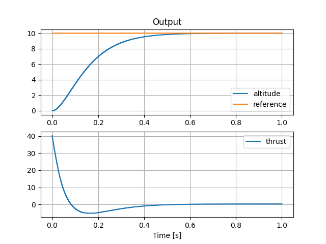

.. _introduction-label:

Introduction
============

**Active disturbance rejection control** (ADRC) is a model-free, robust control method, combining the simplicity of PID controllers and the powerful state observers from modern control theory.

The basic premise of ADRC is to approximate a plant using low-order processes (mostly limited to first and second-orders) and extend this approximation by a virtual state, which is then estimated online using a state observer (usually called an **extended state observer** (ESO) in ADRC context).

The estimated virtual state is the **total disturbance** (i.e. not accounted by our approximation using low-order processes) which acts on the plant, including any nonlinearity unknown to the designer. The estimated total disturbance is used then in the state-feedback to **decouple the plant**, resulting in a state-feedback controller which rejects the total disturbance in real-time.

Step-by-step ADRC
-----------------

.. note::

    Head over to Section :ref:`api-label` for detailed explanation of the complete library.
    
First, as the designer, we need to determine whether our process is better approximated by a first- or a second-order process.

.. tip::

    If your process responds to an input with a time-delay, chances are, it can be approximated by a first-order process. 

    However, if there is oscillatory behaviour and some overshoot/undershoot, it is best approximated as a second-order process.

    N-order processes are usually a combination of the aforementioned elementary components.

Then, you need the **gain parameter** :math:`b_0` of your process (sometimes also called a modeling parameter). The optimal value is given by:

    * For first-order processes

    .. math::

        G(s) = \frac{K}{s\cdot T + 1} \implies b_0 = \frac{K}{T}

    * For second-order processes

    .. math::

        G(s) = \frac{K}{s^2 \cdot T + 2\cdot D \cdot T + 1} \implies b_0 = \frac{K}{T^2}

.. important::

    This parameter can also be determined by trial-and-error, and it does not have to be perfectly tuned. Somewhere in the vicinity of 50% of the actual value is enough to get a satisfiying closed-loop behaviour.

There are two parameters which determine the **controller** and the **observer** bandwidth - **settling time** and **kESO**:

    * **Settling time:**

        This determines the closed-loop response. Specifically, it is the time (in seconds) it takes for the process to reach the 10%-band of the steady-value. The controller gains are calculated using this parameter.

    * :math:`k_{ESO}`

        Determines how fast the poles of the extended state observer is in relation to the controller gains. Usually an integer between 3 and 10.

.. important::

    Using these two parameters, this implementation of ADRC employs **bandwidth parametrisation**. It places the observer poles in a common location in s- or z-plane and reduces tuning parameters to two.

Congratulations! Tuning an ADRC is that simple!

Example - Quadcopter
--------------------

Imagine you have a quadcopter, and you need the drone to hover at a certain altitude. 

.. note::

    The equations governing the relationship between rotor thrust and altitude is given as the following:

    .. math::

        \ddot{z} = g - (\cos{\phi}\cos{\theta})\cdot\frac{u}{m}

    Where *g* is the gravity, *u* is the thrust provided by the rotors and *m* is the mass of the quadcopter. Considering a perfectly horizontal quadcopter, pitch and roll are zero, and the equation reduces to:

    .. math::

        \ddot{z} = g - \frac{u}{m}

    Implemented as:

    .. code-block:: python
       
       quadcopter = pyadrc.QuadAltitude(dt, m, g)

Let :math:`g` be the gravity of Earth and the mass :math:`m = 0.028 kg`

We will use a second-order approximation for all our cases and sampling time

+--------+------------+-------------------+-----------------+
|        |:math:`b_0` | settling time [s] | :math:`k_{ESO}` |
+--------+------------+-------------------+-----------------+
| Case 1 |  1/0.028   |       0.5         |       10        |
+--------+------------+-------------------+-----------------+
| Case 2 |            |                   |                 |
+--------+------------+-------------------+-----------------+
| Case 3 |            |                   |                 |
+--------+------------+-------------------+-----------------+

    Case 1

Lets try the same configuration with an imperfect :math:`b_0 = 1`